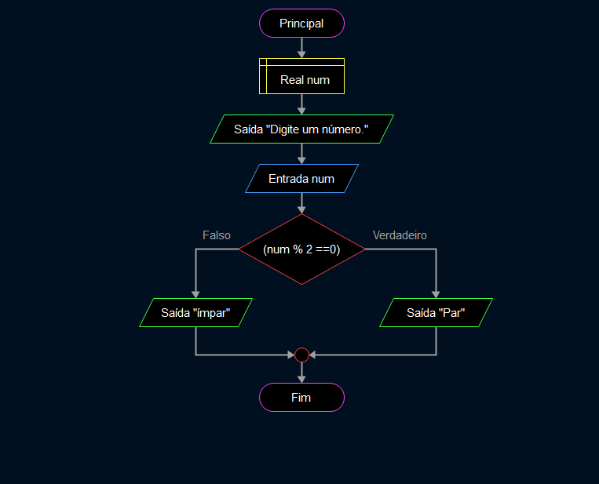

O objetivo desse exercício é descobrir se um número é par ou ímpar. 🔢

- Se o número dividir perfeitamente por 2 ➗, ele é **par** 🔴.
- Se não, ou seja, sobrar 1 ✖️, ele é **ímpar** ⚪.

### Por exemplo:

- **6** é par porque 6 dividido por 2 não sobra nada ✔️.
- **7** é ímpar porque 7 dividido por 2 sobra 1 ✖️.

É um exercício simples 💡, mas ajuda a entender como usar divisões e restos 🧮 em programação. Basicamente, é para aprender a classificar números de maneira fácil e rápida! 🚀
